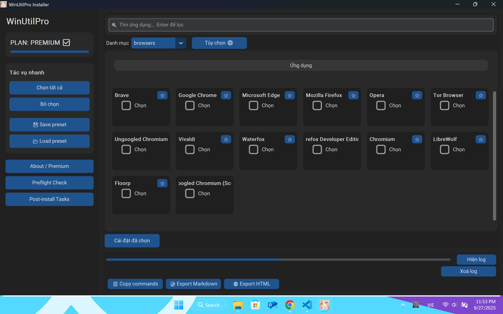

---

````markdown
# 🚀 WinUtilPro Installer

[](https://www.python.org/)
[](./LICENSE)

WinUtilPro Installer là phần mềm **cài đặt nhiều ứng dụng cùng lúc** trên Windows, sử dụng `winget` và script tuỳ chỉnh.  
Giao diện viết bằng **Python + CustomTkinter**, dễ dùng, hỗ trợ **Favorites** và **Premium Features**.

---

## ✨ Tính năng

- 🖥️ **UI trực quan**: chọn app bằng checkbox, tìm kiếm nhanh, lọc theo category.  
- ⭐ **Favorites**: lưu app hay dùng để cài lại nhanh.  
- 📋 **Log panel**: theo dõi tiến trình cài đặt (ẩn/hiện để giảm lag).  
- 🔑 **Premium**:
  - Không giới hạn số app
  - Flag nâng cao: `--silent`, `--upgrade`, `--force`, `--admin`
  - Xuất `.bat`, chạy trực tiếp `WinUtil.ps1`
  - Tùy chọn mở rộng khác

---

## 📷 Screenshots

> Giao diện chính (Main Window)



> About / Premium


---

## 📦 Cài đặt

### Yêu cầu hệ thống
- Windows 10/11 (x64)
- Đã cài **winget**
- Python 3.11+ (nếu chạy source)

### Cài đặt từ source
```bash
git clone https://github.com/longurara/winutilpro-installer
cd winutilpro-installer
pip install -r requirements.txt
python installer.py
````

### Dùng bản đóng gói `.exe`

Tải từ [Releases](https://github.com/longurara/winutilpro-installer/releases)
👉 Không cần Python, chạy trực tiếp.

---

## 🛠️ Sử dụng

1. Chọn category hoặc Favorites.
2. Tick ứng dụng muốn cài.
3. Bấm **Install**.
4. Theo dõi log.
5. Với Premium → có thể xuất script `.bat` hoặc chạy PowerShell trực tiếp.

---

## 🔑 Basic vs Premium

| Tính năng                 | Basic (Free) | Premium        |
| ------------------------- | ------------ | -------------- |
| Giới hạn app / lượt       | 5            | Không giới hạn |
| Tìm kiếm, lọc category    | ✅            | ✅              |
| Favorites                 | ✅            | ✅              |
| Flag nâng cao (Silent...) | ❌            | ✅              |
| Xuất `.bat`, WinUtil.ps1  | ❌            | ✅              |

---

## 🤝 Đóng góp

Mọi đóng góp đều được hoan nghênh!

* Fork repo → tạo nhánh → PR
* Mở issue nếu phát hiện bug/đề xuất tính năng

---

## 📜 License

Dự án phát hành theo [MIT License](./LICENSE).

---

## 👨‍💻 Tác giả

* **longurara**
* GitHub: [@longurara](https://github.com/longurara)

```
